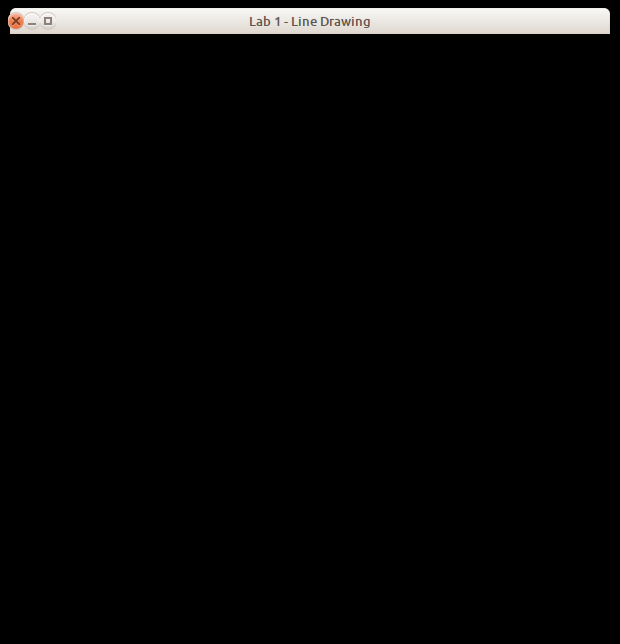
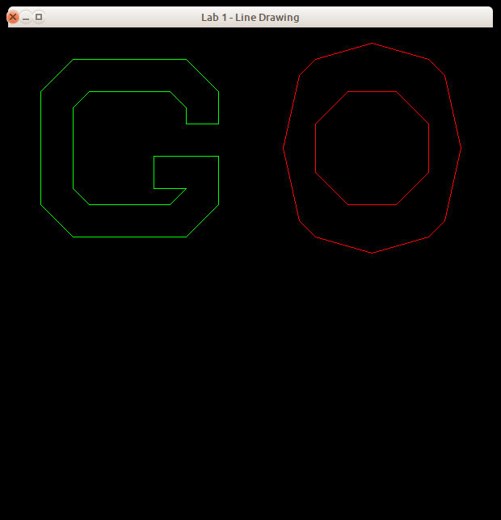
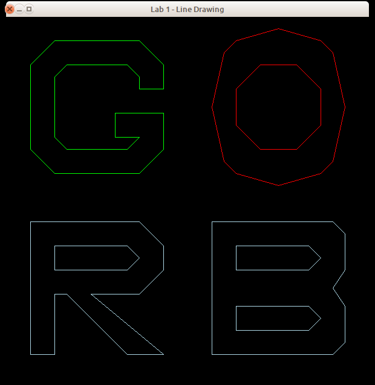

# Lab 1 - Line Drawing

## 1. Introduction

In this course, you will implement some of the 2D drawing routines we have been discussing in class. This will help improve your understanding of these algorithms.

This assignment involves line drawing. You will implement the Midpoint Line Drawing algorithm discussed in class. You have the option of doing this assignment in C or C++.

**Before moving forward, it is recommended that you create another Git branch for your work.** To create a new Git branch for this repository, run `git branch <your-new-branch-name-here>` followed by `git checkout <your-new-branch-name-here>`. We will be triggering "submissions" via **pull request** into the master branch.

## 2. Programming Environment

The programming environment that you will use for this assignment (along with the the remainder of the 2D assignments) is a set of simple modules with implementations in C and C++. These modules are designed as object-oriented classes in the C++ version, and as equivalent non-OO versions in C. You are free to use either of the implementations. The classes include:

* `Buffers` - a support module providing OpenGL vertex and element buffer support.
* `Canvas` - a simple 2D image module that allows the ability to set a pixel.
* `Rasterizer` - a rasterization module which includes a Canvas for drawing.
* `ShaderSetup` - a support module that handles shader program compilation and linking.
* `lineMain` - the main program for the application.
* `shader.vert`, `shader.frag` - simple GLSL 1.50 shaders.
* `alt.vert`, `alt.frag` - simple GLSL 1.20 shaders.

The C version includes a module named `FloatVector` which provides an extensible vector holding floating-point values. Both the C and C++ versions include a file named `header.mak` for use with the `gmakemake` program on our systems to create a `Makefile` to simplify compilation and linking of the program.

See the **Supplied Files** section (below) for details on how to download the framework.


## 3. Routines to Implement

You will need to modify the `Rasterizer` module. For this assignment, you will need to complete the method `drawLine()` using the Midpoint Line Drawing algorithm, and the method `myInitials()` to draw your initials (see below).

In your `drawLine()` implementation, you need only make use of the method `setPixel()` on the `Canvas` object (which is part of the `Rasterizer`) holding the pixels being drawn.

The prototypes for the `drawLine()` and `myInitials` methods vary a bit between languages:

### C
```c
void drawLine( int x0, int y0, int x1, int y1, Rasterizer *R );
void myInitials( Rasterizer *R );
```

### C++
```c++
void drawLine( int x0, int y0, int x1, int y1 );
void myInitials( void );
```

In all cases, the line is drawn from vertex `(x0,y0)` to vertex `(x1,y1)`. The additional parameter in the C version is due to the fact that C is not an object-oriented language. In C++, the `drawLine()` method is part of the `Rasterizer` class, and is invoked in the standard way:

```cpp
Rasterizer R;

R.drawLine( ... );
```

In C, because `drawLine()` is a standalone function, the `Rasterizer` it is being applied to must be supplied as a parameter:

```c
Rasterizer *R;

drawLine( ..., R );
```

You are free to add additional members and methods to `Rasterizer` as you see fit; however, you cannot modify any other module.

In addition to implementing the `drawLine()` method, you must modify the `myInitials()` method to add your own first and last initials to the image, drawing these letters in blue. You are free to use any style you wish for these letters; the only constraint is that they should be drawn as a series of line segments (as the existing letters are drawn).

Our in-class discussion of the midpoint line algorithm covered the case where the line segment had a small positive slope (**0 &lt; m &lt; 1**); your implementation must also handle the other three cases (large positive slope, small negative slope, and large negative slope). Also, remember that our discussion assumed that the line was being drawn from left to right (i.e., that `x0` was less than `x1`); you are not guaranteed that this will be the case, so you'll need to remember to check the incoming coordinates and swap the vertices if necessary.

Figure 1 below shows the image produced by the framework if you compile and execute it without making any changes. Figure 2 below shows the image produced by a correct implementation of the `drawLine()` method (the driver program includes code to draw the letters 'G' and 'O'). Figure 3 shows the complete solution for a student with the initials 'RB', drawn using the same style as the original letters by code added to the `myInitials()` method.

| Figure 1 | Figure 2 | Figure 3 |
|-|-|-|
|  |  |  |

## 4. Supplied Files

The programming framework for this assignment is available in the `./lab1` subfolder beneath this page.

Under the `./lab1` folder, are subfolders `c` and `c++`, which contain the obvious things. In the C and C++ folders you'll find a file named `header.mak`, for use on the CS systems to help you generate a `Makefile` that will compile and link your program with the libraries used by the framework. See the contents of `header.mak` for details on how to do this. There is also a subfolder named `misc` which contains a shellscript named `compmac` for use on Mac systems.

## 5. What to Submit

Your implementations will be tested using a set of driver programs; some of them may be different from the driver found in the framework archive.

The minimum acceptance test is that your code must be complete - that is, it must compile and link cleanly when submitted. Submissions **will not be accepted** if they fail to compile and link cleanly. *(Warning messages from the compiler are acceptable, but not fatal errors.)*

To submit your work, commit your changes to your CSCI 510 Git repository and push it to your remote Github repository, using something like the following:

```sh
git stage .
git commit -m "My commit message"
git push
```

After you have committed your work and pushed to `remote`, create a pull request (a *PR*) on Github and assign/invite your
instructur to the PR (in this case `jake-brandt`). If you decide that you would like to submit further changes after already kicking off your PR, just tag your instructor (something along the lines of "`@jake-brandt I have additional changes`") in a comment on the PR thread and let your instructor know that there are new changes which you would like to include in your graded assignment.

## 6. Grading

Your grade will be based on your implementation of the required routine and its usability with the supplied test programs. Grading will be based on a 0-50 point scale.

The lists of situations to be checked in your submission (see below) is not exhaustive; the tests run during grading may include other combinations. You may want to modify the test program you are given to cover a wide range of input situations.

### `drawLine` Implementation, 35 points
* Gentle positive slope
* Gentle negative slope
* steep positive slope  
* steep negative slope
* horizontal
* vertical
* diagonal
* polygon drawn with multiple calls to `drawLine`

### `myInitials` Implementation, 5 points
 * initials are clearly drawn</td>

### Other Considerations, 10 points
* documentation

## 7. Notes

Java applets are available online to help you visualize
[line drawing](https://cs.rit.edu/~ncs/whatsInALine/whatsInALine.html).

You are guaranteed that the dimensions of the drawing window will be 600x600 pixels.

The vertices given to `drawLine()` may occur in any order - that is, there is no guarantee that `(x0,y0)` is the leftmost vertex of the line segment.

You are to implement the integer Midpoint algorithm discussed in class. Implementations of other approaches (Bresenham's, slope/intercept, floating point, etc.) will receive **no credit**.

It is common knowledge that the code for the Midpoint algorithm is freely available on the Internet and in textbooks. You are free to use these references as a guide, but please do not simply cut and paste code from any of these sources.

Refer back to the "Hello, OpenGL!" programming assignment for information about obtaining and installing the GLFW and/or GLEW libraries.

Don't wait until the last minute to submit things! You may, in fact, want to submit even a partially-working solution as you work on it - there is no penalty for making multiple submissions, and this will help ensure that you get **something** submitted for this assignment.

Do not make any changes to the function prototypes. This means that your implementations must match the prototypes exactly in terms of number, types, and order of parameters.

The reason for this is that the test programs assume that your implementations match those prototypes; if you make changes, there will be compilation errors, and even if the test programs link, they almost certainly won't execute correctly (which means you'll lose substantial amounts of credit for incorrect program performance).

**Ubuntu&reg; is a registered trademark of Canonical Ltd.**