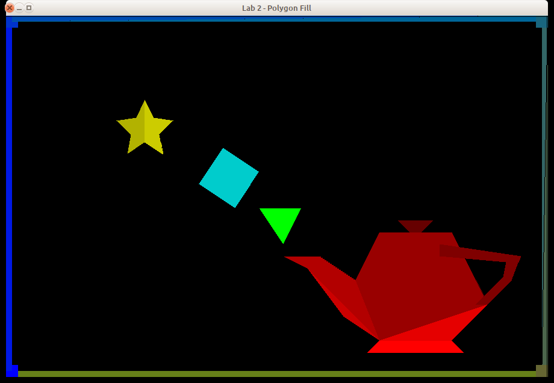

# Lab 2 - Polygon Filling

## 1. Introduction

In this course, you will implement some of the 2D drawing routines we have been
discussing in class. This will help improve your understanding of these algorithms.


This assignment involves polygon filling. You will implement the scanline polygon
fill algorithm discussed in class. You have the option of doing this assignment
in C, or C++.

**Before moving forward, it is recommended that you create another Git branch for your
work.** To create a new Git branch for this repository, run
`git branch <your-new-branch-name-here>` followed by
`git checkout <your-new-branch-name-here>`. We will be triggering "submissions" via
**pull request** into the master branch.

## 2. Programming Environment

The programming environment that you will use for this assignment (along with the the
remainder of the 2D assignments) is a set of simple modules with implementations in C
and C++. These modules are designed as object-oriented classes in the C++ version, and
as equivalent non-OO versions in C. You are free to use either of the implementations.
The classes include:

* `Buffers` - a support module providing OpenGL vertex and element buffer support.
* `Canvas` - a simple 2D image module that allows the ability to set a pixel.
* `Rasterizer` - a rasterization module which includes a Canvas for drawing.
* `ShaderSetup` - a support module that handles shader program compilation and linking.
* `fillMain` - the main program for the application.
* `shader.vert`, `shader.frag` - simple GLSL 1.50 shaders.
* `alt.vert`, `alt.frag` - simple GLSL 1.20 shaders.

The C version includes a module named `FloatVector` which provides an extensible
vector holding floating-point values. Both the C and C++ versions include a file named
`header.mak` for use with the `gmakemake` program on our systems to create a
`Makefile` to simplify compilation and linking of the program.

See the **Supplied Files** section (below) for details on how to download the
framework.


## 3. Routines to Implement

You will need to modify the `Rasterizer` module. For this assignment, you will need to
complete the method `drawPolygon()` using the scanline fill algorithm discussed in
class. _(You are free to use whichever version of the algorithm - all-integer or
floating-point - seems appropriate to you.)_

In your implementation, you need only make use of the method `setPixel()` on the
`Canvas` object (which is part of the `Rasterizer`) holding the pixels being drawn.

The prototype for the `drawPolygon()` method varies a bit between languages:

### C
```c
void drawPolygon( int n, const int x[], const int y[], Rasterizer *R );
```

### C
```c++
void drawPolygon( int n, const int x[], const int y[] );
```

Where x and y are arrays containing the coordinates of the polygon to be drawn, and n
is the number of vertices in the polygon (and, as such, indicates the size of the two
coordinate arrays).

You are free to add additional members, methods, and data structures to Rasterizer as
you see fit; however, you cannot modify any of the other modules in the program.

Here is the drawing that will be produced by the fillMain program:



With the exception of the green triangle and the blue quad, all other objects
(including the borders) are drawn as multiple polygons. Furthermore, each polygon is
drawn using a different color to make it easier to identify problem areas in your
implementation. See the fillMain driver program for full details on the various shapes.

## 4. Supplied Files

The programming framework for this assignment is available in the `./lab2` subfolder
beneath this page.

Under the `./lab2` folder, are subfolders `c` and `c++`, which contain the obvious
things. In the C and C++ folders you'll find a file named `header.mak`, for use on the
CS systems to help you generate a `Makefile` that will compile and link your program
with the libraries used by the framework. See the contents of `header.mak` for details
on how to do this. There is also a subfolder named `misc` which contains a shellscript
named `compmac` for use on Mac systems.

## 5. What to Submit

Your implementations will be tested using a set of driver programs; some of them may
be different from the driver found in the framework archive.

The minimum acceptance test is that your code must be complete - that is, it must
compile and link cleanly when submitted. Submissions **will not be accepted** if they
fail to compile and link cleanly. *(Warning messages from the compiler are acceptable,
but not fatal errors.)*

To submit your work, *commit* your changes to your CSCI 510 Git repository and *push*
it to your remote Github repository, using something like the following:

```sh
git stage .
git commit -m "My commit message"
git push
```

After you have committed your work and pushed to `remote`, create a pull request (a
*PR*) on Github and assign/invite your
instructur to the PR (in this case `jake-brandt`). If you decide that you would like
to submit further changes after already kicking off your PR, just tag your instructor
(something along the lines of "`@jake-brandt I have additional changes`") in a comment
on the PR thread and let your instructor know that there are new changes which you
would like to include in your graded assignment.

## 6. Grading

Your grade will be based on your implementation of the required routine and its
usability with the supplied test programs. Grading will be based on a 0-50 point scale.

The lists of situations to be checked in your submission (see below) is not exhaustive
the tests run during grading may include other combinations. You may want to modify
the test program you are given to cover a wide range of input situations.

### `drawPolygon` Implementation, 40 points
* right triangles
* other triangles
* convex figures - rectangles/quads
* other convex figures
* concave figures - one concave side
* concave figures - more than one concave side
* complicated concave figures (e.g., star)

### Other Considerations, 10 points
* documentation

## 7. Notes

Java applets are available online to help you visualize
[polyon filling](https://cs.rit.edu/~icss571/filling/).

You are guaranteed that the dimensions of the drawing window will be 900x600 pixels.

The elements of the `x[]` and `y[]` arrays are paired up; that is, vertex 0 is
`(x[0],y[0])`, vertex 1 is `(x[1],y[1])`, etc. You are guaranteed that there will be
`n` coordinates in each array. You are also guaranteed that the vertices given to
`drawPolygon()` are listed in order around the circumference of the polygon (that is,
adjacent vertices in the arrays form one edge of the polygon, with the final edge
connecting the last vertex to the first vertex); however, the list may be in either
clockwise or counter-clockwise order.

It is common knowledge that the code for the Midpoint algorithm is freely available on
the Internet and in textbooks. You are free to use these references as a guide, but
please do not simply cut and paste code from any of these sources.

Refer back to the "Hello, OpenGL!" programming assignment for information about
obtaining and installing the GLFW and/or GLEW libraries.

Don't wait until the last minute to submit things! You may, in fact, want to submit
even a partially-working solution as you work on it - there is no penalty for making
multiple submissions, and this will help ensure that you get **something** submitted
for this assignment.

Do not make any changes to the function prototypes. This means that your
implementations must match the prototypes exactly in terms of number, types, and order
of parameters.

The reason for this is that the test programs assume that your implementations match
those prototypes; if you make changes, there will be compilation errors, and even if
the test programs link, they almost certainly won't execute correctly (which means
you'll lose substantial amounts of credit for incorrect program performance).

**Ubuntu&reg; is a registered trademark of Canonical Ltd.**