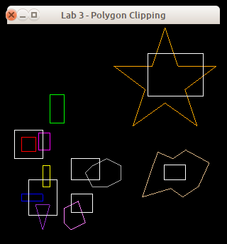
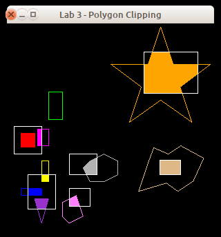

# Lab 3 - Clipping

## 1. Introduction

In this course, you will implement some of the 2D drawing routines we have been discussing in class. This will help improve your understanding of these algorithms.

This assignment involves polygon clipping. You will implement the Sutherland-Hodgman Polygon Clipper discussed in class. You have the option of doing this assignment in C or C++.

**Before moving forward, it is recommended that you create another Git branch for your work.** To create a new Git branch for this repository, run `git branch <your-new-branch-name-here>` followed by `git checkout <your-new-branch-name-here>`. We will be triggering "submissions" via **pull request** into the master branch.

## 2. Programming Environment

The programming environment that you will use for this assignment (along with the the remainder of the 2D assignments) is a set of simple modules with implementations in C and C++. These modules are designed as object-oriented classes in the C++ version, and as equivalent non-OO versions in C. You are free to use either of the implementations.

The classes include:

* `Buffers` - a support module providing OpenGL vertex and element buffer support.
* `Canvas` - a simple 2D image module that allows the ability to set a pixel.
* `Rasterizer` - a rasterization module which includes a Canvas for drawing.
* `ShaderSetup` - a support module that handles shader program compilation and linking.
* `clipMain` - the main program for the application.
* `shader.vert`, `shader.frag` - simple GLSL 1.50 shaders.
* `alt.vert`, `alt.frag` - simple GLSL 1.20 shaders.

The C version includes a module named `FloatVector` which provides an extensible vector holding floating-point values. Both the C and C++ versions include a file named `header.mak` for use with the `gmakemake` program on our systems to create a `Makefile` to simplify compilation and linking of the program.

See the **Supplied Files** section (below) for details on how to download the framework.


## 3. Routine to Implement

You will need to modify the `Clipper` module. For this assignment, you will need to complete the method `clipPolygon()`, implementing the Sutherland-Hodgman Polygon Clipper algorithm. Here is the prototype for this method:

```c
int clipPolygon( int in,
                 const Vertex inV[],
                 Vertex outV[],
                 Vertex ll,
                 Vertex ur );
```

where `in` is the number of vertices in the polygon to be clipped, `inV` is an array holding the coordinates of the polygon vertices _before_ clipping, _outV_ is the array that will hold the coordinates of the polygon vertices _after_ clipping,_ll_ and _ur_ are the coordinates of the lower-left and upper-right corners of the clipping rectangle. The function should return the count of vertices after clipping (i.e., the number of vertices which were placed into _outV_ by your code.)

You are free to add additional data members and methods to the `Clipper` module as you see fit; however, you cannot modify any of the other modules.

Here are the image that will be produced by the `clipMain` program with the original `Clipper` module found in the framework, and the image produced when `Clipper` contains a working **Sutherland Hodgman Polygon Clipper** implementation:

<blockquote>
<table cellpadding="3">
<tr>
<td>
 
</td>
<td>
 
</td>
</tr>
<tr>
<td class="center"><em>Unmodified framework</em></td>
<td class="center"><em>With working Clipper module</em></td>
</tr>
</table>
</blockquote>

Within these images, outlines in white show the clipping regions; outlines in other colors are the outlines of the original polygons before clipping. Solid-color areas are the polygons that result from clipping against the clipping regions.

In the `clipMain` driver program provided with the framework, the red polygon is entirely inside its clipping region; the blue, yellow, purple (technically, "dark orchid"), and magenta polygons each have portions outside their clipping regions on a single side; and the grey and pink polygons have portions outside their clipping regions on multiple sides. The green polygon is being clipped against the upper-left square clipping region; because it is entirely outside of that region, all of its vertices are eliminated by the clipping process. The orange polygon has one or more vertices outside with respect to each edge of its clipping region, and the light brown polygon completely encloses its clipping region.

## 4. Supplied Files

The programming framework for this assignment is available in the `./lab3` subfolder beneath this page.

Under the `./lab3` folder, are subfolders `c` and `c++`, which contain the obvious things. In the C and C++ folders you'll find a file named `header.mak`, for use on the CS systems to help you generate a `Makefile` that will compile and link your program with the libraries used by the framework. See the contents of `header.mak` for details on how to do this. There is also a subfolder named `misc` which contains a shellscript named `compmac` for use on Mac systems.

## 5. What to Submit

Your implementations will be tested using a set of driver programs; some of them may be different from the driver found in the framework archive.

The minimum acceptance test is that your code must be complete - that is, it must compile and link cleanly when submitted. Submissions **will not be accepted** if they fail to compile and link cleanly. *(Warning messages from the compiler are acceptable,
but not fatal errors.)*

To submit your work, *commit* your changes to your CSCI 510 Git repository and *push*
it to your remote Github repository, using something like the following:

```sh
git stage .
git commit -m "My commit message"
git push
```

After you have committed your work and pushed to `remote`, create a pull request (a *PR*) on Github and assign/invite your instructur to the PR (in this case `jake-brandt`). If you decide that you would like to submit further changes after already kicking off your PR, just tag your instructor (something along the lines of "`@jake-brandt I have additional changes`") in a comment on the PR thread and let your instructor know that there are new changes which you would like to include in your graded assignment.

## 6. Grading

Your grade will be based on your implementation of the required routine and its usability with the supplied test programs. Grading will be based on a 0-50 point scale.

The lists of situations to be checked in your submission (see below) is not exhaustive the tests run during grading may include other combinations. You may want to modify the test program you are given to cover a wide range of input situations.

### `clipPolygon` Implementation, 40 points
* entire figure inside region entire figure outside region
* one vertex outside with respect to one edge
* one vertex outside w/r/t two edges
* two vertices outside w/r/t one edge
* two vertices outside w/r/t two edge
* multiple vertices outside region
* all vertices outside region

### Other Considerations, 10 points
* documentation and programming style

## 7. Notes

Java applets are available online to help you visualize polygon clipping [here](http://min.nl/cs426/) and [here](http://cs.rit.edu/~icss571/clipTrans/PolyClip.html).

You are guaranteed that the dimensions of the drawing window will be 300x300 pixels.

Recall that the SHPC algorithm discussed in class clips the incoming vertex list against _one side_ of the clipping region. To clip against the entire region, you'll need to apply the SHPC algorithm four times (once per edge of the region) with the output vertex list from each application being fed as the input vertex list to the next application.

You are guaranteed that there will be `in` vertices in the `inV` array, and that they are listed in order around the circumference of the polygon (that is, adjacent vertices in the arrays form one edge of the polygon, with the final edge connecting the last vertex to the first vertex); however, the list may be in either clockwise or counter-clockwise order. (The test program(s) used during grading will make the same assumptions about the vertex count returned from `clipPolygon()`, and the sequencing of the vertices `outV[]` array.)

It is common knowledge that code for the Sutherland-Hodgman algorithm is freely available on the Internet and in textbooks. You are free to use these references as a guide, but please do not simply cut and paste code from any of these sources.

Refer back to the
[Hello, OpenGL!](https://www.cs.rit.edu/~jab/courses/csci510/protected/labs/hello/) programming assignment for information about obtaining and installing the GLFW and/or GLEW libraries.

Don't wait until the last minute to submit things! You may, in fact, want to submit even a partially-working solution as you work on it - there is no penalty for making multiple submissions, and this will help ensure that you get _something_ submitted for this assignment.

Do not make any changes to the function prototypes. This means that your implementations must match the prototypes exactly in terms of number,types, and order of parameters. The reason for this is that the test programs assume that your implementations match those prototypes; if you make changes, there will be compilation errors, and even if the test programs link, they almost certainly won't execute correctly (which means you'll lose substantial amounts of credit for incorrect program performance).

The `shader.vert` and `shader.frag` files supplied with the framework require GLSL version 1.50, which is only available with OpenGL 3.2 or newer. If you are attempting to develop your code on a system which doesn't have a new-enough version of GLSL, you'll get error messages when these files are compiled during the execution of your code. The driver program will automatically "fall back" to the alternate shaders if GLSL 1.50 isn't available.

**Ubuntu&reg; is a registered trademark of Canonical Ltd.**