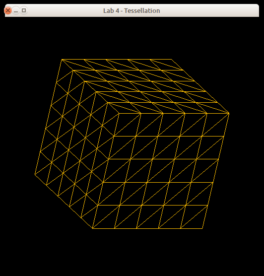
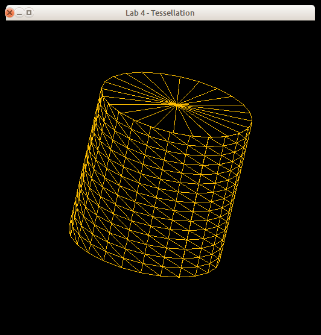
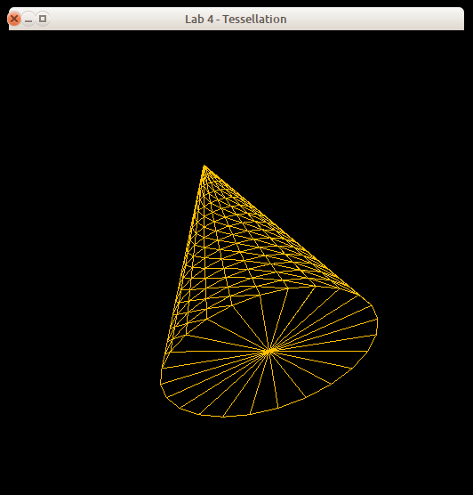
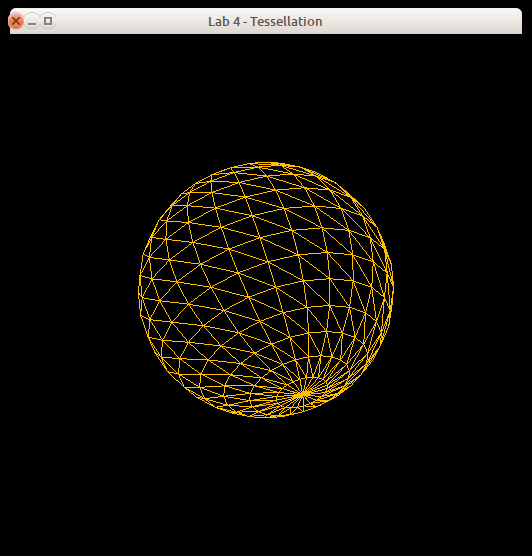

# Lab 4 - Tessellation

## 1. Introduction

In this assignment, you will gain an understanding of what happens behind the scenes when you create objects whose surfaces are not simple polygons. Computer graphics hardware devices are typically optimized to handle triangles. The process of dividing a surface into a series of triangles is called *tessellation*.

In this assignment you will be responsible for creating tessellations of four basic shapes: a cube, a cylinder, a cone, and a sphere. Here are examples of tessellated versions of these shapes:

<blockquote>
<table cellpadding="2" cellspacing="2">
<tr>
<td align="center">
</td>
<td align="center">
</td>
</tr>
<tr>
<td align="center">
</td>
<td align="center">
</td>
</tr>
</table>
</blockquote>

(In this image, the sphere has been implemented using the latitude/longitude method described in class.) In addition, your solution will be an interactive one; you will vary the tessellation of the objects' surfaces in response to user input.

**Before moving forward, it is recommended that you create another Git branch for your work.** To create a new Git branch for this repository, run `git branch <your-new-branch-name-here>` followed by `git checkout <your-new-branch-name-here>`. We will be triggering "submissions" via **pull request** into the master branch.

## 2. Programming Environment

The programming environment that you will use for this assignment (along with the the remainder of the 2D assignments) is a set of simple modules with implementations in C and C++. These modules are designed as object-oriented classes in the C++ version, and as equivalent non-OO versions in C. You are free to use either of the implementations.

The classes include:

* `Buffers` - a support module providing OpenGL vertex and element buffer support.
* `Canvas` - a support module that provides functions for manipulating the shape being defined.
* `ShaderSetup` - a support module that handles shader program compilation and linking.
* `Shapes` - a support module that will contain tessellation code for the four shapes.
* `Vertex` - a module that describes the structure of a vertex.
* `tessMain` - the main program for the application.
* `shader.vert`, `shader.frag` - simple GLSL 1.50 shaders.
* `alt.vert`, `alt.frag` - simple GLSL 1.20 shaders.

The C version includes a module named `FloatVector` which provides an extensible vector holding floating-point values. Both the C and C++ versions include a file named `header.mak` for use with the `gmakemake` program on our systems to create a `Makefile` to simplify compilation and linking of the program.

See the **Supplied Files** section (below) for details on how to download the framework.

A working demo of the completed assignment can be found in `~cscix10/pub/demos/tessMain`. (You can either `cd` into that directory to run it, or run it from another directory using the full pathname; you cannot copy the file, nor can you run it via the web server.)

A second version of the demo program can be found in `~cscix10/pub/demos/tessBad`. This version intentionally reverses the vertices of the first triangle in each shape so that it's drawn "backwards". You can see the effect as the shape is rotated; a "backwards" triangle will appear to be missing when you look at what should be its front side (facing outward in the shape), and will be drawn when you are looking at it through the shape (because you're seeing its front side then).

The template program is interactive; it accepts keyboard input to control the display. The following keys can be used to operate the program:

<table>

<tr>
<th>Key(s)</th>
<th>Function</th>
</tr>

<tr>
<td class="center">a, A</td>
<td>
Animate the rotation of the current shape around the x-axis, y-axis, and z-axis in sequence
</td>
</tr>

<tr>
<td class="center">x, y, z</td>
<td>
Rotate the current shape forward about the x, y, or z axis
</td>
</tr>

<tr>
<td class="center">X, Y, Z</td>
<td>
Rotate the current shape backward about the x, y, or z axis
</td>
</tr>

<tr>
<td class="center">1, c</td>
<td>
Select the cube as the current shape (using current tessellation settings)
</td>
</tr>

<tr>
<td class="center">2, C</td>
<td>
Select the cylinder as the current shape (using current tessellation settings)
</td>
</tr>

<tr>
<td class="center">3, n</td>
<td>
Select the cone as the current shape (using current tessellation settings)
</td>
</tr>

<tr>
<td class="center">4, s</td>
<td>
Select the sphere as the current shape (using current tessellation settings)
</td>
</tr>

<tr>
<td class="center">+, -</td>
<td>
Increment/decrement the primary subdivision of the current shape by 1
</td>
</tr>

<tr>
<td class="center">=, _</td>
<td>
Increment/decrement the secondary subdivision of the current shape by 1
</td>
</tr>

<tr>
<td class="center">/</td>
<td>
Reset the primary and secondary subdivisions to 1
</td>
</tr>

<tr>
<td class="center">r, R</td>
<td>
Reset the figure to its original orientation
</td>
</tr>

<tr>
<td class="center">q, Q</td>
<td>
Quit the application
</td>
</tr>

</table>


## 3. Routine to Implement

You must edit the `Shapes` module and supply implementations for four functions: `makeCube()`, `makeCylinder()`, `makeCone()`, and `makeSphere()`. Pay close attention to the comments included in this file, as they explain what each function should do. For each triangle in the tessellation you must call `addTriangle()` to ensure that its vertices are included in the list for drawing.

For the sphere, the `makeSphere()` function is set up to accept the radius of the sphere and two tessellation factors (number of slices and number of stacks) as parameters. This implies that the sphere should be implemented using the latitude/longitude method. If you wish to implement the recursive subdivision method, you will use only the first tessellation factor; the second factor should be ignored.

All of the prototypes for the `make*()` functions begin with code that forces a known lower bound on the tessellation factor. This is particularly important for the "disc" portion of the cylinder and cone, and for both factors for the sphere, because otherwise you'll get a really strange-looking shape.

**CAUTION:** For all shapes, calls to `addTriangle()` **must** list vertices in counter-clockwise order. OpenGL treats polygons with vertices listed in this order as front-facing. Failure to do this will cause your shapes to appear inside-out. (You can tell if you have made this mistake by watching the figure as you rotate it; if any of the triangles are backwards, they will disappear from the figure as you rotate it around to look at them.)


## 4. Supplied Files

The programming framework for this assignment is available in the `./lab4` subfolder beneath this page.

Under the `./lab4` folder, are subfolders `c` and `c++`, which contain the obvious things. In the C and C++ folders you'll find a file named `header.mak`, for use on the CS systems to help you generate a `Makefile` that will compile and link your program with the libraries used by the framework. See the contents of `header.mak` for details on how to do this. There is also a subfolder named `misc` which contains a shellscript named `compmac` for use on Mac systems.

## 5. What to Submit

Your implementations will be tested using a set of driver programs; some of them may be different from the driver found in the framework archive.

The minimum acceptance test is that your code must be complete - that is, it must compile and link cleanly when submitted. Submissions **will not be accepted** if they fail to compile and link cleanly. *(Warning messages from the compiler are acceptable,
but not fatal errors.)*

To submit your work, *commit* your changes to your CSCI 510 Git repository and *push*
it to your remote Github repository, using something like the following:

```sh
git stage .
git commit -m "My commit message"
git push
```

After you have committed your work and pushed to `remote`, create a pull request into the base lab4 branch (a *PR*) on Github and assign/invite your instructur to the PR (in this case `jake-brandt`). If you decide that you would like to submit further changes after already kicking off your PR, just tag your instructor (something along the lines of "`@jake-brandt I have additional changes`") in a comment on the PR thread and let your instructor know that there are new changes which you would like to include in your graded assignment.


## 6. Grading

Your grade will be based on your implementation of the required routine and its usability with the supplied test programs. Grading will be based on a 0-50 point scale.

The lists of situations to be checked in your submission (see below) is not exhaustive the tests run during grading may include other combinations. You may want to modify the test program you are given to cover a wide range of input situations.

### Proper tessellation, 10 points per shape
* The shapes look correct; there are no extra or missing triangles; the shape does not look inside-out (i.e., correct faces are drawn); etc.

### Handles parameters, 2 points
* Changing the parameters correctly changes the degree of tessellation.

### Stability and efficiency, 2 points
* The program does not crash or have memory leaks; for these simple shapes, increasing the degree of tessellation does not result in overly sluggish performance.

### Other Considerations, 6 points
* Documentation and programming style


## 7. Notes

You are encouraged to discuss the tessellation algorithms with other students in the class (as well as myself). However, *you must write your own code*. Please **do not use code obtained from the web**. If you've spent time obfuscating a published solution, you are likely *more* than capable of implementing these algorithms yourself; trust me!

The lecture notes presented in class should help you to get started on this assignment.

The cube, cylinder, and cone should all be one unit wide (e.g., for the cube, the faces are all at offsets of 0.5 in the appropriate direction; for the cylinder, the disks have radius 0.5 and are 0.5 units from the origin along the *y* axis; etc.), and each should be centered at the origin.

The sphere should also be centered at the origin and should have a diameter of one unit. If you are implementing the recursive subdivision method, remember that the vertex positions for the icosahedron in the lecture notes are for an icosahedron of *radius* one (i.e., *diameter* two). As a result, unless you normalize the vertices and scale by 0.5, the icosahedron will appear distorted because of the position of the camera.

The primary and secondary subdivision numbers are used as follows:

* For the cube, only the primary subdivision value is used, and all faces are subdivided identically. The minimum value of this factor should be one.

* For the cone and cylinder, the primary subdivision controls the number of sides on the figure (i.e., the subdivision of the disks), and the secondary subdivision controls the height. The minimum number of sides should be three (i.e., if a value less than three is given for the primary subdivision, use three instead), and the minimum height factor should be one.

* If you are implementing the recursive subdivision version of the sphere, only the primary subdivision value is used. The minimum value of this should be one; for efficiency reasons, you should also set a maximum value of five for this parameter.

* If you are implementing the latitude/longitude version of the sphere, the primary subdivision should control the number of slices per disk (the theta direction) and the secondary subdivision should control the number of stacked disks (the phi direction). The minimum values of each of these should be three.

The `Shapes` files in the framework are all set up to use the bounds described above for the tessellation factors. (For the sphere, the bounds are set for the latitude/longitude version; you will need to modify them if you are using recursive subdivision.)

Refer back to the
[Hello, OpenGL!](https://www.cs.rit.edu/~jab/courses/csci510/protected/labs/hello/) programming assignment for information about obtaining and installing the GLFW and/or GLEW libraries.

Don't wait until the last minute to submit things! You may, in fact, want to submit even a partially-working solution as you work on it - there is no penalty for making multiple submissions, and this will help ensure that you get _something_ submitted for this assignment.

Do not make any changes to the function prototypes. This means that your implementations must match the prototypes exactly in terms of number,types, and order of parameters. The reason for this is that the test programs assume that your implementations match those prototypes; if you make changes, there will be compilation errors, and even if the test programs link, they almost certainly won't execute correctly (which means you'll lose substantial amounts of credit for incorrect program performance).

The `shader.vert` and `shader.frag` files supplied with the framework require GLSL version 1.50, which is only available with OpenGL 3.2 or newer. If you are attempting to develop your code on a system which doesn't have a new-enough version of GLSL, you'll get error messages when these files are compiled during the execution of your code. The driver program will automatically "fall back" to the alternate shaders if GLSL 1.50 isn't available.

**Ubuntu&reg; is a registered trademark of Canonical Ltd.**