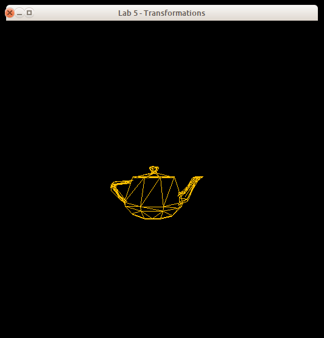
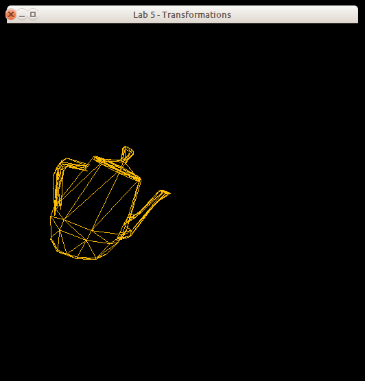
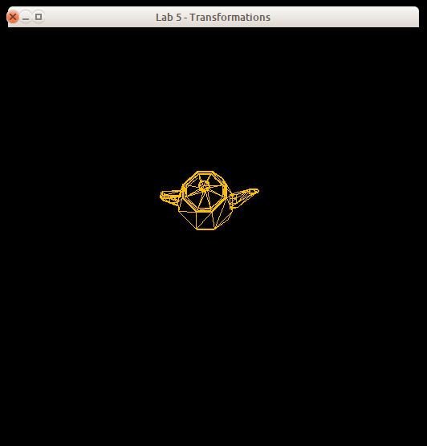
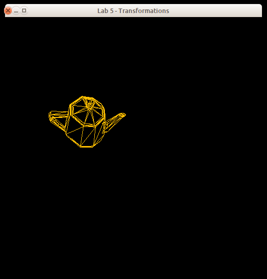
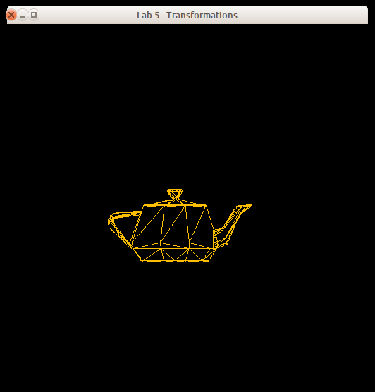
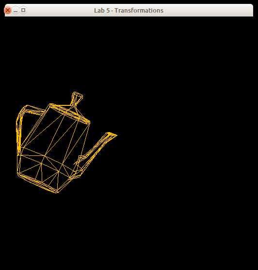
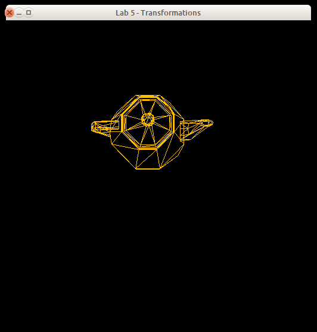
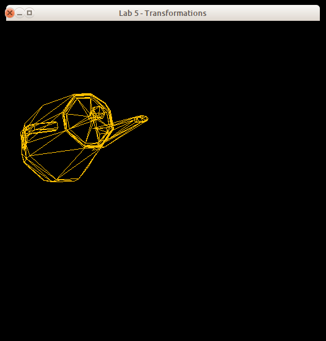

# Lab 5 - 3D Transformations

## 1. Introduction

In this assignment, you will work with OpenGL and GLSL to implement 3D transformations; more specifically:

* **Model transformation** - Take vertices from model to world coordinates
* **View transformation** - Take vertices from world to camera coordinates
* **Projection transformation** - Take vertices from camera to clip coordinates

You are to write a vertex shader that will transform a tessellated object according to the model, camera, and projection transformations described below. The parameter values for the transformations will be provided from an OpenGL application, and will be given to your shader through the use of appropriate OpenGL API calls.

Your shader will implement both frustum and orthographic projections of a single tessellated object. The desired projection type must be given to your shader by the OpenGL application.

The driver program allows the selection of the type of projection, which camera position to use (default, or modified), and whether or not to apply object transformations. Thus, there are eight different possible views of the object, as shown here:

<blockquote>
<table frame="box" rules="all" cellpadding="2" cellspacing="3">
<thead>
<tr>
  <td rowspan="2" align="center"><em>Projection<br>Type</em></td>
  <td colspan="2" align="center"><em>Default Camera</em></td>
  <td colspan="2" align="center"><em>Modified Camera</em></td>
</tr>
<tr>
  <td align="center">No object transformations</td>
  <td align="center">Object transformations</td>
  <td align="center">No object transformations</td>
  <td align="center">Object transformations</td>
</tr>
<tbody>
<tr>
  <td align="center">Frustum</td>
  <td align="center" valign="middle">
    
  </td>
  <td align="center" valign="top">
    
  </td>
  <td align="center" valign="top">
    
  </td>
  <td align="center" valign="top">
    
  </td>
</tr>
<tbody>
<tr>
  <td align="center">Orthographic</td>
  <td align="center" valign="top">
    
  </td>
  <td align="center" valign="top">
    
  <td align="center" valign="top">
    
  </td>
  <td align="center" valign="top">
    
  </td>
</tr>
</tbody>
</table>
</blockquote>

**Before moving forward, it is recommended that you create another Git branch for your work.** To create a new Git branch for this repository, run `git branch <your-new-branch-name-here>` followed by `git checkout <your-new-branch-name-here>`. We will be triggering "submissions" via **pull request** into the master branch.

## 2. Programming Environment

As with the previous assignments,a programming environment is supplied for you. This environment uses OpenGL, GLUT, and GLEW, and is supplied in C and C++ versions. You are free to use either of these implementations. The environment includes the following:

* `Buffers` - a support module providing OpenGL vertex and element buffer support.
* `Canvas` - a support module that provides functions for manipulating the shape being defined.
* `ShaderSetup` - a support module that handles shader program compilation and linking.
* `Shapes` - a module containing code to draw a teapot.
* `Vertex` - a module that describes the structure of a vertex.
* `Tuple` - a module that describes a three-valued data item.
* `Viewing` - a support module that contains code for defining and managing the model and camera transformations and sending data to the shader program.
* `v150.vert`, `v150.frag` - simple GLSL 1.50 shaders.
* `v120.vert`, `v120.frag` - simple GLSL 1.20 shaders.
* `transMain` - the main function for the application.

The C version includes a module named `FloatVector` which provides an extensible vector holding floating-point values. Both the C and C++ versions include a file named `header.mak` for use with the `gmakemake` program on our systems to create a `Makefile` to simplify compilation and linking of the program.

See the **Supplied Files** section (below) for details on how to download the framework.

Unlike previous lab assignments, the `transMain` driver program will **not** automatically select between the GLSL 1.20 and GLSL 1.50 versions of the shader files; it will always try to load `shader.vert` and `shader.frag`. However, no files with those names are provided in the framework! Instead, you should select the GLSL version you will be using to develop your vertex shader, and copy either the `v120` _or_ the `v150` versions of the shaders into files named `shader.vert` and `shader.frag`. Your submission will be tested on a machine which can use either version (1.20 or 1.50).

A working demo of the completed assignment will be found in `~cscix10/pub/demos/transMain`. (You may either `cd` into that directory to run it, or run it from another directory.)

The template program is interactive; it accepts keyboard and mouse input to control the display. The following inputs can be used to operate the program:

<table border="1">
<tr><th>Key(s)</th><th>Function</th></tr>
<tr>
  <td class="center">f, F</td>
  <td> Select the frustum projection </td>
</tr>
<tr>
  <td class="center">o, O</td>
  <td> Select the orthographic projection </td>
</tr>
<tr>
  <td class="center">mouse click</td>
  <td> Cycle through the different camera and transformation combinations </td>
</tr>
<tr>
  <td class="center">q, Q</td>
  <td> Quit the application </td>
</tr>
</table>


## 3. Routine to Implement

You must edit the `Viewing` module and provide implementations for the following functions:

<ul>
    <li>
        <p>
        <code>setUpProjection( GLuint program, ViewMode mode )</code>
        </p>
        <p>
        Send all the appropriate parameters to the vertex shader to use the
        projection specified by the <code>mode</code> parameter (either
        <code>Frustum</code> or <code>Ortho</code>).
        </p>
    <li>
        <p>
        <code>clearTransforms( GLuint program )</code>
        </p>
        <p>
        Send all the appropriate parameters for the default model transformations
        (see below).
        </p>
    <li>
        <p>
        <code>clearCamera( GLuint program )</code>
        </p>
        <p>
        Send all the appropriate parameters for the default camera (see below).
        </p>
    <li>
        <p>
        <code>setUpTransforms( GLuint program, Tuple scale, Tuple rotate, Tuple translate )</code>
        </p>
        <p>
        Sends all the appropriate parameters for the model transformations.
        </p>
    <li>
        <p>
        <code>setUpCamera( GLuint program, Tuple eye, Tuple lookat, Tuple up)</code>
        </p>
        <p>
        Sends all the appropriate parameters for camera manipulation.
        </p>
</ul>

In all cases, the `program` argument is the ID of the active shader program; you will need to use this ID to gain access to the shader global variables you must modify. The `Tuple` type is simply a `struct` containing three floating-point values in fields named `x`, `y`, and `z`.

In addition, you must create a `shader.vert` file to implement the various transformations required of the program. Use either the `v120.vert` or `v150.vert` sample vertex shader as the starting point for your work, depending on which OpenGL/GLSL version you have. (Don't forget to copy the corresponding `.frag` file into `shader.frag`!)

The supplied framework draws the teapot; however the initial setup will not give you a complete view of the object because no model or camera transformations have been applied to it.

The transformation values that you need to apply have already been provided by transMain through calls to the various functions in the Viewing module. The default values for these settings (i.e., what the program begins execution with and what it should return to when the model and camera settings are "clear"ed) are as follows:

<ul>
    <li>
        <p>
        <em>Model transformations:</em> by default, there should be no
        transformation of the model.  Thus, all scale factors should be 1.0, and
        all rotation angles and all translation factors should be 0.0.
        </p>
    <li>
        <p>
        <em>Camera settings:</em> the default camera position should be the
        standard OpenGL default:  eyepoint at the origin <code>(0,0,0)</code>;
        lookat set to <code>(0,0,-1)</code>; and up vector
        set to <code>&lt;0,1,0&gt;</code>.)
        </p>
    <li>
        <p>
        <em>Projection settings:</em> regardless of the projection type being
        used, the boundaries on the view volume will be:  left -1.0, right 1.0,
        bottom -1.0, top 1.0, near 0.9, and far 4.5.
        </p>
</ul>

The driver program will occasionally apply other model and camera settings via calls to `setUpTransforms()` and `setUpCamera()`. The order of application of model transformations matters; here is the order in which they should be applied:

<ul>
    <li>Scale in the <em>y</em> direction by a factor of 2
    <li>Rotate around the <em>z</em> axis by 335 degrees
    <li>Rotate around the <em>y</em> axis by 10 degrees
    <li>Translate by -0.2 in the <em>x</em> direction and by 0.2 in the <em>y</em> direction
</ul>

Once implemented, the application will allow you switch between the projection types using the '1' (frustum) and '2' (orthographic) keys, and between the various combinations of model and camera transformations using the left mouse button.

In implementing these transformations, you may either construct the matrices in your OpenGL application and send them to the shader as a matrix, or send the data required to build the matrices to the shader and have the vertex shader construct them. (It is <em>strongly</em> recommended that you do this in the vertex shader for this assignment, even though this is much less efficient, as this eliminates the need for a separate matrix library. For more explanation of this, see the _Notes_ section, below.)

Regardless of where you construct your matrices, all data used by the shaders (either the complete matrices or the original "raw data" used to construct them) must be copied down to the shaders from the application. **In no case can you embed any of these parameters or the resulting matrices as "magic numbers" in your shaders!** (This includes the view volume settings; although in this assignment the boundaries never change, this may not always be the case.)

## 4. Supplied Files

The programming framework for this assignment is available in the `./lab5` subfolder beneath this page.

Under the `./lab5` folder, are subfolders `c` and `c++`, which contain the obvious things. In the C and C++ folders you'll find a file named `header.mak`, for use on the CS systems to help you generate a `Makefile` that will compile and link your program with the libraries used by the framework. See the contents of `header.mak` for details on how to do this. There is also a subfolder named `misc` which contains a shellscript named `compmac` for use on Mac systems.

## 5. What to Submit

Your implementations will be tested using a set of driver programs; some of them may be different from the driver found in the framework archive.

The minimum acceptance test is that your code must be complete - that is, it must compile and link cleanly when submitted. Submissions **will not be accepted** if they fail to compile and link cleanly. *(Warning messages from the compiler are acceptable,
but not fatal errors.)*

To submit your work, *commit* your changes to your CSCI 510 Git repository and *push*
it to your remote Github repository, using something like the following:

```sh
git stage .
git commit -m "My commit message"
git push
```

After you have committed your work and pushed to `remote`, create a pull request into the base lab4 branch (a *PR*) on Github and assign/invite your instructur to the PR (in this case `jake-brandt`). If you decide that you would like to submit further changes after already kicking off your PR, just tag your instructor (something along the lines of "`@jake-brandt I have additional changes`") in a comment on the PR thread and let your instructor know that there are new changes which you would like to include in your graded assignment.


## 6. Grading

Your grade will be based on your implementation of the required routine and its usability with the supplied test programs. Grading will be based on a 0-50 point scale.

The lists of situations to be checked in your submission (see below) is not exhaustive the tests run during grading may include other combinations. You may want to modify the test program you are given to cover a wide range of input situations.

### Creates a window, 5 points
* Your code compiles, runs, and produces a stable window.

### Correct object transformations, 10 points

### Correct camera manipulation, 10 points

### Correct frustum projection, 10 points

### Correct orthographic projection, 10 points

### Documentation and style, 5 points

## 7. Notes

Remember that the driver program will only use the names `shader.vert` and `shader.frag` for the shader programs, so you must copy the `v120` versions if you will be using GLSL 1.20 or the `v150` versions if you will be using GLSL 1.50.

The OpenGL and GLSL lecture notes presented in class should help you to get started on this assignment, as should the files provided with earlier OpenGL assignments.

Refer back to the "Hello, OpenGL!" programming assignment for information about obtaining and installing GLUT and/or GLEW libraries.

You have the choice of doing your matrix creation in either the vertex shader or in the OpenGL application itself. Doing this in the vertex shader is simpler, because GLSL provides all the necessary data types and operations to create and manipulate matrices; in the OpenGL application, you will need to either write or acquire a set of matrix manipulation routines. This ease does come with a price, though - creating and manipulating the matrices in the shader means that this will occur separately for every single vertex in the object being drawn, rather than just once, so doing this in the shader is less efficient. However, the objects you will be drawing in this (and later) labs are small enough that efficiency isn't really a problem, so we recommend that you create and manipulate your matrices in the shader (at least for now).

If you choose to do your matrix manipulation in the OpenGL application instead of in the shader, you'll need to either create your own matrix routines, or use an open-source matrix library. The following libraries are available on the CS Ubuntu systems and are freely available for installation on your own system:

* **C:** [The GNU Scientific Library](http://www.gnu.org/software/gsl/) - GSL version 2.4 is installed on the CS lab machines; the `header.mak` supplied with the framework is set up to automatically link your code using this library.
* **C++:** [Matrix TCL Pro](http://www.techsoftpl.com/matrix/) - Matrix TCL Pro version 2.2 is available in the course account on the CS systems, in the [~cscix10/lib/matclpro](http://cs.rit.edu/~cscix10/lib/matclpro/) directory. To use it, copy the three files from the [cscix10/lib/matclpro/include](http://cs.rit.edu/~cscix10/lib/matclpro/include/) directory into your working directory, and include the `cmatrix` file using the `#include` format shown in the _What To Submit_ section (above).
* **C++:** [GLM](http://glm.g-truc.net/0.9.8/) - GLM 0.9.9-a2 is installed on the CS lab machines; for greatest compatibility, you may wish to install that version on your own system.

For convenience, archive files for the Matrix TCL Pro 2.2 and GLM 0.9.9-a2 can be found in the course account; see the directory [~cscix10/lib/archives](http://cs.rit.edu/~cscix10/lib/archives) for these files.

If you are using one of these libraries unmodified, please do not submit them along with your solutions; we will provide a copy of Matrix TCL Pro in the working directory for C++ submissions, and the other libraries are installed in standard places on the lab machines. However, if you are using a modified version of one of these libraries or a different matrix library, you **must** submit your library along with your solution.

**Ubuntu&reg; is a registered trademark of Canonical Ltd.**