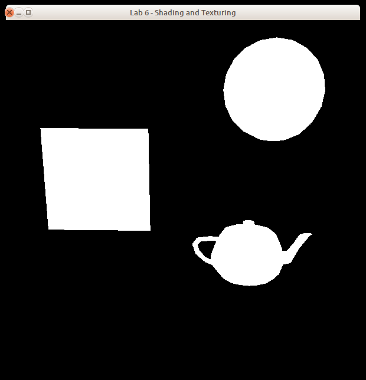
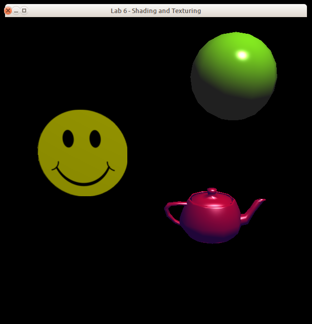
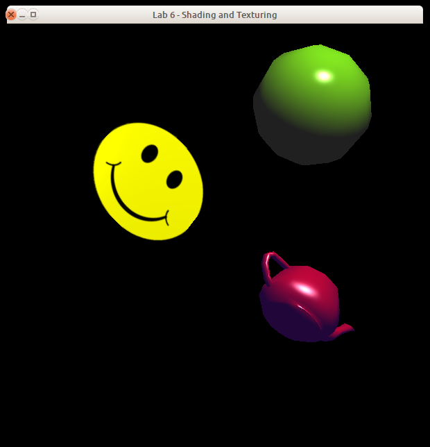
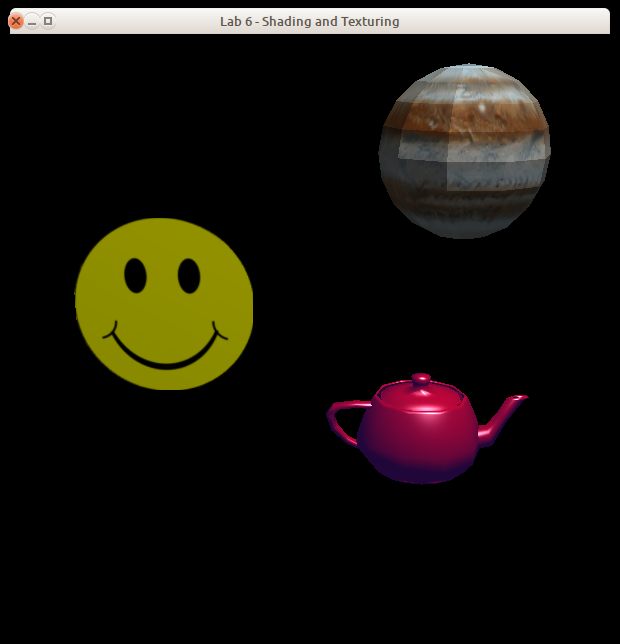

# Lab 6 - Textures and Lighting

## 1. Introduction

In this assignment, you will work with OpenGL and GLSL to implement
lighting, materials, shading, and two-sided texture mapping.
You will be producing Phong-shaded and texture-mapped
shapes using the Phong Illumination Model.

Recall that the Phong illumination model contains three components
describing how light reflects off an object:

<blockquote>
<table border="0">
<tr>
  <td><em>Ambient</em></td>
  <td>&nbsp;</td>
  <td>Reflection due to "background" light</td>
</tr>
<tr>
  <td><em>Diffuse</em></td>
  <td>&nbsp;</td>
  <td>Equal reflection of light from a light source in all directions</td>
</tr>
<tr>
  <td><em>Specular</em></td>
  <td>&nbsp;</td>
  <td>"Mirror-like" reflection of light from a light source</td>
</tr>
</table>
</blockquote>

Also recall that basic texture mapping involves using data from a texture
image in place of the basic material properties of the object.
This "color" is then used in place of the <em>O<sub>d</sub></em> (etc.)
values in the Phong equations.

As in all the assignments this term, this framework
uses OpenGL, GLFW, and GLEW; if you have completed those assignments
successfully on your own system,
you have working versions of these libraries
and you should be ready to go on this assignment.

The framework we are providing for you contains two sets of basic
shader files (vertex and fragment shaders) for Phong shading and
texture mapping.
Your task is to modify these shaders to produce the required shading
effects, and to modify the accompanying application code to provide the
required data to the shaders.

The scene you will be rendering consists of a teapot, a sphere, and a quad,
illuminated by a single point light and some ambient light.
The material and lighting parameters are as follows (colors are specified
using RGBA notation; positions are given using homogeneous coordinates):

### Properties of the teapot:

* Ambient material color = ( 0.5, 0.1, 0.9, 1.0 )
* Diffuse material color = ( 0.89, 0.0, 0.0, 1.0 )
* Specular material color = ( 1.0, 1.0, 1.0, 1.0 )
* Ambient reflection coefficient (ka) = 0.5
* Diffuse reflection coefficient (kd) = 0.7
* Specular reflection coefficient (ks) = 1.0
* Specular exponent = 10.0

### Properties of the sphere:

* Ambient material color = ( 0.5, 0.5, 0.5, 1.0 )
* Diffuse material color = ( 0.49, 0.99, 0.0, 1.0 )
* Specular material color = ( 1.0, 1.0, 1.0, 1.0 )
* Ambient reflection coefficient (ka) = 0.5
* Diffuse reflection coefficient (kd) = 0.8
* Specular reflection coefficient (ks) = 1.0
* Specular exponent = 50.0

### Reflective characteristics of the quad:

* Ambient reflection coefficient (ka) = 0.7
* Diffuse reflection coefficient (kd) = 0.7
* Specular reflection coefficient (ks) = 1.0
* Specular exponent = 40.0

### Properties of the light source:

* Position = ( 3.0, 9.0, 2.0, 1.0 )
* Color = ( 1.0, 1.0, 1.0, 1.0 )

### Ambient light in the scene:

* Color = ( 0.5, 0.5, 0.5, 1.0 )

The placement of the objects and the camera are provided for you.
The camera uses a frustum projection.

The program accepts keyboard input as follows:

<blockquote>
<table border="1" cellpadding="2">
<tr>
  <td align="center">a</td>
  <td>Start animation</td>
</tr>
<tr>
  <td align="center">r</td>
  <td>Reset objects to their initial positions</td>
</tr>
<tr>
  <td align="center">s</td>
  <td>Stop animation</td>
</tr>
<tr>
  <td align="center">q, Q</td>
  <td>Exit from the program</td>
</tr>
</table>
</blockquote>

With no modification, the framework produces images the three objects
in white.
Here are examples of the original image and the images produced by the
different types of shaders (click on each image to show a larger version
of it):

<table border="0" cellpadding="2">
<tr>
  <td align="center">
    <a target="_blank" href="Texting0.png">
    
  </td>
  <td align="center">
    <a target="_blank" href="Texting1.png">
    
    </a>
  </td>
  <td align="center">
    <a target="_blank" href="Texting2.png">
    
    </a>
  </td>
  <td align="center">
    <a target="_blank" href="Texting3.png">
    
    </a>
  </td>
  <td align="center">
    <a target="_blank" href="Texting4.png">
    
    </a>
  </td>
</tr>
</table>

The leftmost image shows the image produced by the framework as it is unpacked from the ZIP archive. The second image shows the initial image after you have correctly implemented shading and texture mapping. The third and fourth images show the image after some animation has been done; the fourth shows the "frowny face" that was applied to the back of the quad. The final image shows a Jupiter texture applied to the sphere. As the animation proceeds, you can see the effect of the rotation and translation of objects relative to the position of the light source.

**Before moving forward, it is recommended that you create another Git branch for your work.** To create a new Git branch for this repository, run `git branch <your-new-branch-name-here>` followed by `git checkout <your-new-branch-name-here>`. We will be triggering "submissions" via **pull request** into the master branch.

## 2. Programming Environment

As with previous assignments, a programming environment is supplied for you. This environment uses OpenGL, GLFW, and GLEW, and is supplied in C and C++ forms. You are free to use either of these implementations. The environment includes the following modules which **should not be modified:**

* `Buffers` - a support module providing OpenGL vertex and
element buffer support.
* `Canvas` - a support module that provides functions for
manipulating the shape.
* `ShaderSetup` - a support module that reads, compiles, and
links GLSL shader programs.
* `Shapes` - definition of objects, including face normals and
vertex normals, for the teapot and quad.
* `textingMain` - the main function for the application.
* `Viewing` - transformation matrices for the shapes and the camera.

You **must** modify and submit the following components:

* `phong.vert, phong.frag` - "starter" GLSL 1.30 shaders for Phong shading
* `texture.vert, texture.frag` - "starter" GLSL 1.30 shaders for texture mapping
* `Lighting` - a support module that contains code for
defining and managing the parameters for the Phong Illumination Model
* `Textures` - support module that contains routines for
loading a texture image and for setting up parameters for using the
texture

You **may** modify and submit the following components (see the _Grading_ section below for more details):

* `Sphere` - definition of the sphere

See the _Supplied Files_ section (below)
for details on how to download the framework.

The shaders for this assignment are written using GLSL 1.30, which matches the OpenGL 3.0 version available in the CS labs. GLSL 1.30 is where the "attribute" and "varying" qualifiers for shader global variables were deprecated in favor of just using "in" and "out", so these shaders look very much like GLSL 1.50 shaders.

If you find that your OpenGL implementation won't compile GLSL 1.30 shaders, you'll need to change them to GLSL 1.20 shaders. To do this, you'll need to modify several things in the shader files:

* Change the `#version` to 120.
* All attribute variables in the vertex shaders should be marked as `attribute` instead of `in`.
* All incoming globals in the fragment shaders should be marked as `varying` instead of `in`.
* All `out` variables in all shader files should be changed to `varying`.
* The final fragment color must be assigned to a pipeline variable named `gl_FragColor` in the fragment shader.

See the `alt.vert` and `alt.frag` files in the
framework for labs 1 through 4 for examples.


## 3. Routines to Implement

You must edit the `Lighting` module and provide an implementation for the following function:

> `void setUpPhong( GLuint program, int obj );`
>
> Send all the appropriate parameters to the shaders to implement Phong Illumination and Phong Shading for the specified object. The `program` argument is the ID of the active shader program; the `obj` argument indicates which object is being drawn (see the `Shapes.h` file for the values that will be passed in). You will need to use the program ID to gain access to the shader global variables you must modify, and the object specification to determine which parameter values to copy into those shader global variables. You only need to modify this single function; you should not modify the `Lighting.h` header file.

Next, you must modify the `Textures` module to provide
implementations for the following functions:

> `void loadTextures( void );`
>
> Used to load whatever texture data your application needs to use. (See below for information about texture image files supplied with the programming framework.) You will need to load at least two texture images (the "smiley face" and the "frowny face") here; this means you will need to use two different texture units, and will need to communicate those unit numbers to your texture shader.

> `void setUpTextures( GLuint program, int obj );`
>
>Used to set up the parameters for texture mapping.

The `program` and `obj` parameters here serve the same function as the same-named parameters in the `setUpPhong()` function.

Finally, you must modify the supplied GLSL shader files to achieve the required shading effects.

**Important note:**
You are not allowed to "hard-code" any of the lighting or texture parameters into the shader files; all of these parameters must be sent to the shaders from your `setUp*()` functions.

## 4. Supplied Files

The programming framework for this assignment is available in the `./lab6` subfolder beneath this page.

Under the `./lab6` folder, are subfolders `c` and `c++`, which contain the obvious things. In the C and C++ folders you'll find a file named `header.mak`, for use on the CS systems to help you generate a `Makefile` that will compile and link your program with the libraries used by the framework. See the contents of `header.mak` for details on how to do this. There is also a subfolder named `misc` which contains a shellscript named `compmac` for use on Mac systems.

This framework also contains a fourth subfolder named `images` which contains the following image files, obtained from[clipartpanda.com](http://www.clipartpanda.com/categories/happy-and-sad-face-clip-art) and[celestiamotherlode.net](http://www.celestiamotherlode.net/catalog/jupiter.php)(some file names changed for simplicity):

* `smiley2.png` - the image you should use for texture mapping the front side of the quad
* `frowny2.png` - the image you should use for texture mapping the back side of the quad
* `realj2ksm.jpg` - the image you should use if you choose to do the extra-credit texture mapping (see the _Grading_ section, below)

> **Note:** You will need to **copy or move** these images into the directory which contains your source code. Please **do not** use relative pathnames (e.g., `"../images/smiley2.png"`) in the code you submit!

When applying the texture image to the quad, you can make use of an OpenGL pipeline variable named `gl_FrontFacing`. This is a Boolean variable which contains the value `true` if the front face of the polygon is being shaded, and `false` otherwise. It is available only in the fragment shader.

## 5. What to Submit

It is expected that most, if not all, changes will be in the following files:

* **Both:** `phong.frag`, `phong.vert`, `texture.frag`, `texture.vert`
* **C:** `Lighting.c` and `Textures.c`
* **C++:** `Lighting.cpp` and `Textures.cpp`

Your implementations will be tested using a set of driver programs; some of them may be different from the driver found in the framework archive.

The minimum acceptance test is that your code must be complete - that is, it must compile and link cleanly when submitted. Submissions **will not be accepted** if they fail to compile and link cleanly. *(Warning messages from the compiler are acceptable,
but not fatal errors.)*

To submit your work, *commit* your changes to your CSCI 510 Git repository and *push*
it to your remote Github repository, using something like the following:

```sh
git stage .
git commit -m "My commit message"
git push
```

After you have committed your work and pushed to `remote`, create a pull request into the base lab4 branch (a *PR*) on Github and assign/invite your instructur to the PR (in this case `jake-brandt`). If you decide that you would like to submit further changes after already kicking off your PR, just tag your instructor (something along the lines of "`@jake-brandt I have additional changes`") in a comment on the PR thread and let your instructor know that there are new changes which you would like to include in your graded assignment.


## 6. Grading

This assignment is worth **50 points**, distributed as follows:

### Creates a window: 5 points
* Your code compiles, runs, and produces a stable window without blowing up.

### Proper object shading: 20 points for Phong shading
* The appearance of the objects is correct, including diffuse and specular effects.

### Proper texture mapping: 20 points for texture mapping
* The appearance of the object is correct, including the orientation and positioning of the images on the quad.

### Documentation and style: 5 points
* Self-explanatory.

> **You also have the opportunity to earn extra-credit points on this assignment:**
>
> Spherical texture mapping: 5 points
> * In addition to applying the "smiley face" and "frowny face" to the quad, you should implement spherical texture mapping to map the Jupiter image onto the sphere instead of doing Phong shading.
> * The driver program invokes a function in the Sphere module named `drawSphere()` when that shape is being drawn. You will need to modify the portion of that function which draws the sphere so that it uses your texture shader instead of your `Phong` shader.
> * You will also need to modify the code in the `makeSphere` function in the `Sphere` module so that it provides texture coordinates for the sphere. (See the code for `makeQuad` in the `Shapes` module for an example.)
> * Finally, you will also need to load the third texture image in your `loadTextures()` function, and you will also need to submit your Sphere.c or Sphere.cpp file with your solution.

## 7. Notes

The OpenGL, GLSL, shading, and texture mapping lecture notes presented in class should help you to get started on this assignment, as should the files provided with earlier OpenGL assignments.

Remember that Phong shading interpolates the normal vector across the polygon (done for you by the rasterizer in the OpenGL pipeline) and calculates color based on that.

Refer back to the "Hello, OpenGL!" programming assignment for information about obtaining and installing GLFW and/or GLEW libraries.

Remember that in addition to transforming the vertex and light locations into clip (eye) space, the vertex shader must also transform the surface normal into clip space. Many vertex shaders use an OpenGL built-in variable named `gl_NormalMatrix` to do this; however, because we are using shader-based OpenGL, you cannot use that variable. Here are some web pages which explain how to calculate it:

* [The Normal Matrix](http://www.lighthouse3d.com/tutorials/glsl-tutorial/the-normal-matrix/)
at `lighthouse3d.com`
* [OpenGL Normal Vector Transformation](http://www.songho.ca/opengl/gl_normaltransform.html) at `songho.ca` _(note: fixed-pipeline aka old OpenGL)_
* [gl_NormalMatrix in GLSL how to calculate?](https://www.gamedev.net/topic/598985-gl-normalmatrix-in-glsl-how-to-calculate/) at `gamedev.net`

Unfortunately, GLSL 1.30 does not have an `inverse()` function for matrices. To help you deal with this, the vertex shader files(`phong.vert` and `texture.vert`) contain implementations of `inverse()` for `float`, `mat2`, `mat3`, and `mat4` data types; these functions were written by Mikola Lysenko, and are available from his GitHub repository (URL in the shader files) under the terms of the MIT License.

You may use convenience libraries for loading your texture images. We recommend the use of SOIL, found online at [http://www.lonesock.net/soil.html](http://www.lonesock.net/soil.html), and already installed on the CS Ubuntu systems. All framework files in which SOIL might be used include the necessary header as `<SOIL.h>` - if you need to include it in other files, use the same path, and (if necessary) tell your compiler where to find the header; the `header.mak` file is set up to properly compile and link against SOIL on the CS Ubuntu systems.

If you are using SOIL on a Mac, you must remember to also use the CoreFoundations framework, as the Mac implementation of SOIL makes use of some of the functions in this framework. The `compmac` script (in the `misc` subfolder of the framework ZIP file) has comments in it pointing this out, as well as indicating changes that must be made to the `libs` and (possibly) `incs` assignments in the script.

SOIL is possible to compile for Windows with Visual Studio (tested on 2017 Community Edition). You may receive errors compiling `test_SOIL.cpp`; if this occurs, you will likely need to include `<ctime>` in this file.

**Ubuntu&reg; is a registered trademark of Canonical Ltd.**