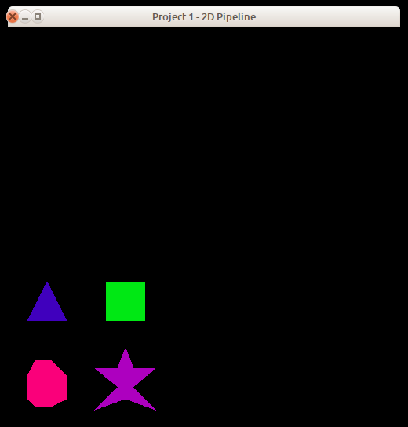
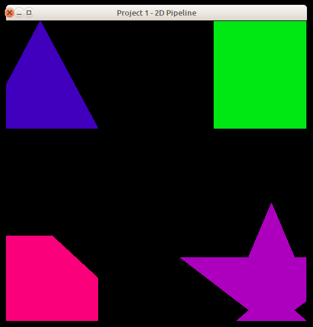
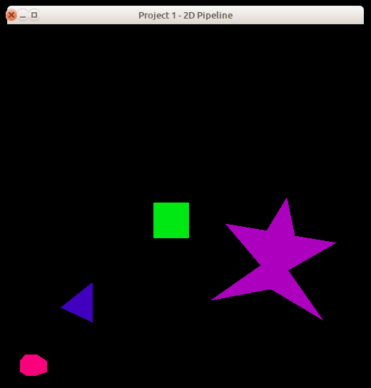
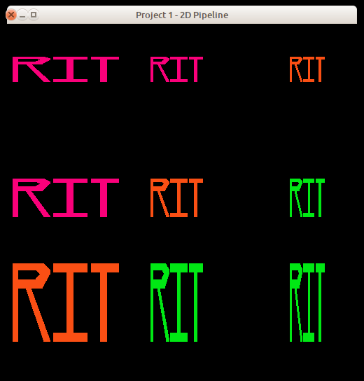

# Midterm - The 2D Pipeline

## 1. Introduction

In this project, you will implement the complete 2D pipeline as presented in class using routines written for previous assignments. This project is in lieu of a traditional midterm exam.

This assignment has the following goals:

* Test your knowledge of the components and algorithms of 2D drawing
* Combine existing code into a complete graphics pipeline application

**Before moving forward, it is recommended that you create another Git branch for your work.** To create a new Git branch for this repository, run `git branch <your-new-branch-name-here>` followed by `git checkout <your-new-branch-name-here>`. We will be triggering "submissions" via **pull request** into the master branch.

## 2. Programming Environment

As with the previous assignments, the programming environment that you will use for this project is a set of simple modules with implementations in C and C++. You are free to use either of the implementations.

The modules include:

* `Buffers` - a support module providing OpenGL vertex and element buffer support.
* `Canvas` - a simple 2D image module that allows the ability to set a pixel.
* `Pipeline` - the module containing the methods you must implement.
* `ShaderSetup` - a support module that handles shader program compilation and linking.
* `Vertex` - a module that describes the structure of a vertex.
* `midtermMain` - the main function for the application.
* `shader.vert`, `shader.frag` - simple GLSL 1.50 shaders.
* `alt.vert`, `alt.frag` - simple GLSL 1.20 shaders.

The C version includes a module named `FloatVector` which provides an extensible vector holding floating-point values. Both the C and C++ versions include a file named `header.mak` for use with the `gmakemake` program on our systems to create a `Makefile` to simplify compilation and linking of the program.

See the **Supplied Files** section (below) for details on how to download the framework.

It is expected that you have working versions of the functions `drawPolygon()` and `clipPolygon()` which you wrote for previous assignments. It is particularly important that you have a working `drawPolygon()` as you will not be able to generate any output without it.

You may be able to drop your `Rasterizer` and `Clipper` modules from labs 2 and 3 into your solution directly with only minor changes. Remember that the lab 2 framework used integer coordinate values, while the lab 3 framework (and this project's framework) use floating-point coordinate values, so there may be some "tweaking" necessary in places.

**If you do not have a working version of `drawPolygon()`,** there is a method within the `Canvas` module named `drawOutline()` that you can use for the project. However, this routine will not fill in the polygon - it only draws the outline. **You should only use this routine if you do not have a working version of the `drawPolygon()` method within your `Rasterizer`.** Alternatively, you may integrate the previously-shared polygon filling solution from lab 2. **_Please note_** that your previous lab 2 submission will be compared against your midterm polygon filling implementation. If the implementation provided with your midterm submission does not match your original implementation, it will be assumed that you are accepting the point reduction (see _6. Grading_). If you are able to identify and fix bugs in your lab 2 submission, please communicate this to your instructor so that you can ensure you are considered for the full-point rubric.

> **Note:** The same spirit applies to your clipping algorithm (see _6. Grading_ for the breakdown).

You will need to perform matrix manipulations in your code. You are welcome to use auxiliary libraries from the Web for matrix manipulation (or alternately, you can write your own). See the _Notes_ section (below) for links to some freely-available matrix packages.


## 3. Routine to Implement

The only provided module that you will need to modify is `Pipeline`. You will add your implementations of the methods in this module. You are free to expand this module by adding other methods and data members, as needed.

You will find the list of methods that must be implemented in the `Pipeline` declaration. The midterm lecture notes presented in class also describe these methods.

You are free to create any additional auxiliary modules or classes that you might need. However, you should not modify the code for `Canvas` or `midtermMain`. You are encouraged to re-use the `Rasterizer` and `Clipper` modules you developed in earlier assignments, or you may choose to re-implement those features for this assignment.

The test driver program runs four separate tests of your implementation: basic polygon drawing; use of a non-standard clip window; model transformations; and non-standard viewports. Its output should look much like these samples:

<blockquote>
<table cellpadding="3">
<tr>
<td align="center">

<br>Basic polygon test
</td>
<td>&nbsp;</td>
<td align="center">

<br>Non-standard clipping test
</td>
<td>&nbsp;</td>
<td align="center">

<br>Model transformation test
</td>
<td>&nbsp;</td>
<td align="center">

<br>Non-standard viewport test
</td>
</tr>
</table>
</blockquote>

Tests can be selected by clicking the left mouse button, or through keyboard input. Each click of the mouse moves to the next test in sequence. The individual tests can be selected with the following keyboard commands:

* `P` and `1` select the basic polygon test,
* `C` and `2` select the clipping test,
* `T` and `3` select the transformation test, and
* `V` and `4` select the viewport test.

By default, the driver starts with image #1 (the basic polygon test). You can supply an integer in the range 1-4 on the command line which indicates which image to start with; e.g., to start with the viewport test, run the program as

```sh
./midtermMain 4
```

If you provide an integer outside that range, or something other than an integer, the program silently defaults to image #1.


## 4. Supplied Files

The programming framework for this assignment is available in the `./midterm` subfolder beneath this page.

Under the `./midterm` folder, are subfolders `c` and `c++`, which contain the obvious things. In the C and C++ folders you'll find a file named `header.mak`, for use on the CS systems to help you generate a `Makefile` that will compile and link your program with the libraries used by the framework. See the contents of `header.mak` for details on how to do this. There is also a subfolder named `misc` which contains a shellscript named `compmac` for use on Mac systems.

## 5. What to Submit

If you are using one of the matrix libraries described below, please **do not** include it in your repository. If you are working in C, the GSL libraries are installed on the CS systems, and the `header.mak` file automatically links against that library.

For C++, if you are using the Matrix TCL Pro package, the three files `cmatrix`, `matrix.cc`, and `matrix2.hxx` files will be in the working directory, and you should use the following statement to include them in your code:

```c++
#include "cmatrix"
```

If you are using GLM, include the main GLM header file this way:

```c++
#include &lt;glm/glm.hpp&gt;
```

or, if you prefer, you may include individual GLM header files by functionality:

```c++
#include &lt;glm/vec3.hpp&gt;
#include &lt;glm/mat3.hpp&gt;
#include &lt;glm/matrix.hpp&gt;
```

etc.

If you are using an external matrix library **other than** the ones described in the _Notes_ section (below), **or** you are using a modified version of one of those libraries, you must submit those files with your submission (by including them in your repository).

The minimum acceptance test is that your code must be complete - that is, it must compile and link cleanly when submitted. Submissions **will not be accepted** if they fail to compile and link cleanly. *(Warning messages from the compiler are acceptable,
but not fatal errors.)*

To submit your work, *commit* your changes to your CSCI 510 Git repository and *push*
it to your remote Github repository, using something like the following:

```sh
git stage .
git commit -m "My commit message"
git push
```

After you have committed your work and pushed to `remote`, create a pull request (a *PR*) on Github and assign/invite your instructur to the PR (in this case `jake-brandt`). If you decide that you would like to submit further changes after already kicking off your PR, just tag your instructor (something along the lines of "`@jake-brandt I have additional changes`") in a comment on the PR thread and let your instructor know that there are new changes which you would like to include in your graded assignment.

## 6. Grading

Your grade will be based on your implementation of the required routine and its usability with the supplied test programs. Grading will be based on a 0-50 point scale.

The lists of situations to be checked in your submission (see below) is not exhaustive the tests run during grading may include other combinations. You may want to modify the test program you are given to cover a wide range of input situations.

* **10 points** for submitting code that compiles, runs, and produces a window.
* **20 points** for basic polygon drawing
    * _Note: reduced to 8 points_ if you are using the supplied `drawOutline()` function or a solution different from your personal lab 2 implementation. Please communicate to your instructor any intention to improve upon your lab 2 implementation; otherwise, it will be assumed you have implemented the instructor's lab 2 solution or a solution available through other means.
* **20 points** for model transformations
* **20 points** for non-standard clipping
    * _Note: reduced to 8 points_ if you are not using your personal lab 3 implementation. Please communicate to your instructor any intention to improve upon your lab 3 implementation; otherwise, it will be assumed you have implemented the instructor's lab 3 solution or a solution available through other means.
* **20 points** for non-standard viewport
* **10 points** for style and documentation

## 7. Notes

You are welcome to use auxiliary libraries from the Web for matrix manipulation (or alternately, you can write your own). There are several good libraries available for these languages; here are the ones we recommend, as all three are available on the CS lab machines (of course, you are free to use whatever
library you like, as long as it is freely available):

* **C:** [The GNU Scientific Library](http://www.gnu.org/software/gsl/) - GSL version 2.4 is installed on the CS lab machines; the `header.mak` supplied with the framework is set up to automatically link your code using this library.
* **C++:** [Matrix TCL Pro](http://www.techsoftpl.com/matrix/) - Matrix TCL Pro version 2.2 is available in the course account on the CS systems, in the [~cscix10/lib/matclpro](http://cs.rit.edu/~cscix10/lib/matclpro/) directory. To use it, copy the three files from the [cscix10/lib/matclpro/include](http://cs.rit.edu/~cscix10/lib/matclpro/include/) directory into your working directory, and include the `cmatrix` file using the `#include` format shown in the _What To Submit_ section (above).
* **C++:** [GLM](http://glm.g-truc.net/0.9.8/) - GLM 0.9.9-a2 is installed on the CS lab machines; for greatest compatibility, you may wish to install that version on your own system.

For convenience, archive files for the Matrix TCL Pro 2.2 and GLM 0.9.9-a2 can be found in the course account; see the directory [~cscix10/lib/archives](http://cs.rit.edu/~cscix10/lib/archives) for these files.

If you are using one of these libraries unmodified, please do not submit them along with your solutions; we will provide a copy of Matrix TCL Pro in the working directory for C++ submissions, and the other libraries are installed in standard places on the lab machines. However, if you are using a modified version of one of these libraries or a different matrix library, you **must** submit your library along with your solution.

Refer back to the
[Hello, OpenGL!](https://www.cs.rit.edu/~jab/courses/csci510/protected/labs/hello/) programming assignment for information about obtaining and installing the GLFW and/or GLEW libraries.

Don't wait until the last minute to submit things! You may, in fact, want to submit even a partially-working solution as you work on it - there is no penalty for making multiple submissions, and this will help ensure that you get _something_ submitted for this assignment.

Do not make any changes to the function prototypes. This means that your implementations must match the prototypes exactly in terms of number,types, and order of parameters. The reason for this is that the test programs assume that your implementations match those prototypes; if you make changes, there will be compilation errors, and even if the test programs link, they almost certainly won't execute correctly (which means you'll lose substantial amounts of credit for incorrect program performance).

The `shader.vert` and `shader.frag` files supplied with the framework require GLSL version 1.50, which is only available with OpenGL 3.2 or newer. If you are attempting to develop your code on a system which doesn't have a new-enough version of GLSL, you'll get error messages when these files are compiled during the execution of your code. The driver program will automatically "fall back" to the alternate shaders if GLSL 1.50 isn't available.

**Ubuntu&reg; is a registered trademark of Canonical Ltd.**